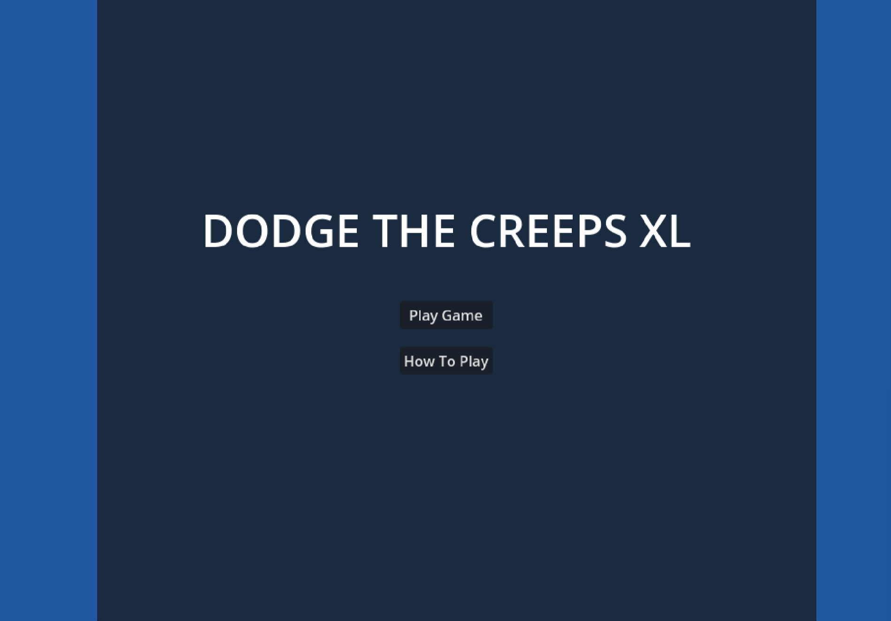
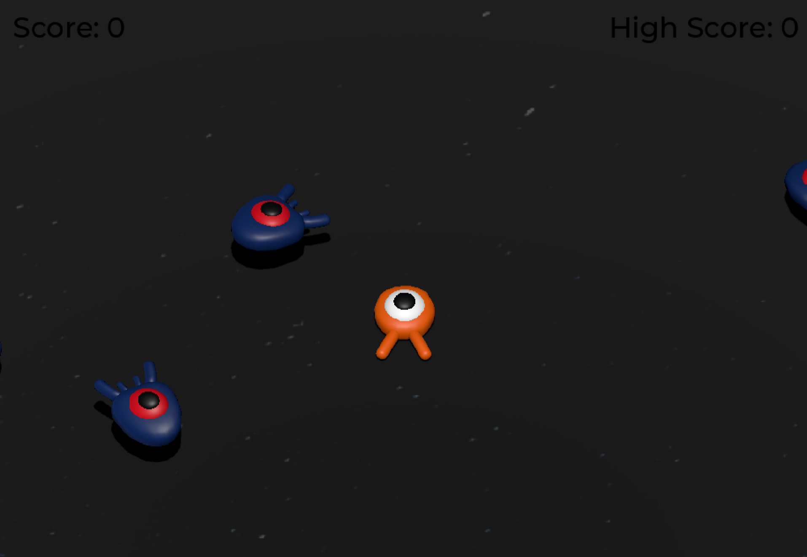

# Dodge-the-Creeps-XL
<a href="https://robrob7.github.io/Dodge-the-Creeps-XL/pages/gameHTML/index.html" target="_blank" rel="noopener noreferrer">Play Now</a>

An expanded 3D reimagining of the classic Godot Dodge the Creeps tutorial, developed in Godot 4.3. The player can move freely across the XY plane and jump along the Y axis to evade or stomp on creeps for points. The game combines smooth movement, 3D visuals, and immersive audio to create a fast-paced and rewarding arcade experience.




<h2>
Requirements
</h2>

- To play: browser that supports WebAssembly and WebGL 2.0 (Firefox, Chrome, Opera, Edge)
- To open with Godot: Godot v4.3 required 
    - ```git clone https://github.com/RobRob7/Dodge-the-Creeps-XL.git```
    - Import project with Godot using ```dodge-the-creeps-xl/project.godot```

<h2>
Features
</h2>

- Player Movement
    - movement system (all directions in the XY-plane)
    - jumping system (jump in Y-plane)
- Scoring system
    - Jump on creeps to score a point
- Audio
    - Music playing in background
    - Audio cues on player squashing creep
    - Audio cues on player dying

<h2>
Project Structure
</h2>

Project source files are found in folder ```dodge-the-creeps-xl/```
- **scripts/**
    - `Global.gd`
    - `how_to_play.gd`
    - `main.gd`
    - `mainmenu.gd`
    - `mob.gd`
    - `player.gd`
    - `score_label.gd`
- **scenes/**
    - `hitmarker.tscn`
    - `how_to_play.tscn`
    - `main.tscn`
    - `mainmenu.tscn`
    - `mob.tscn`
    - `music_player.tscn`
    - `player.tscn`
    - `player_death.tscn`
    - `wall.tscn`
- **fonts/**
    - Fonts used
- **art/**
    - Creeps art
    - Player art
    - Audio files

